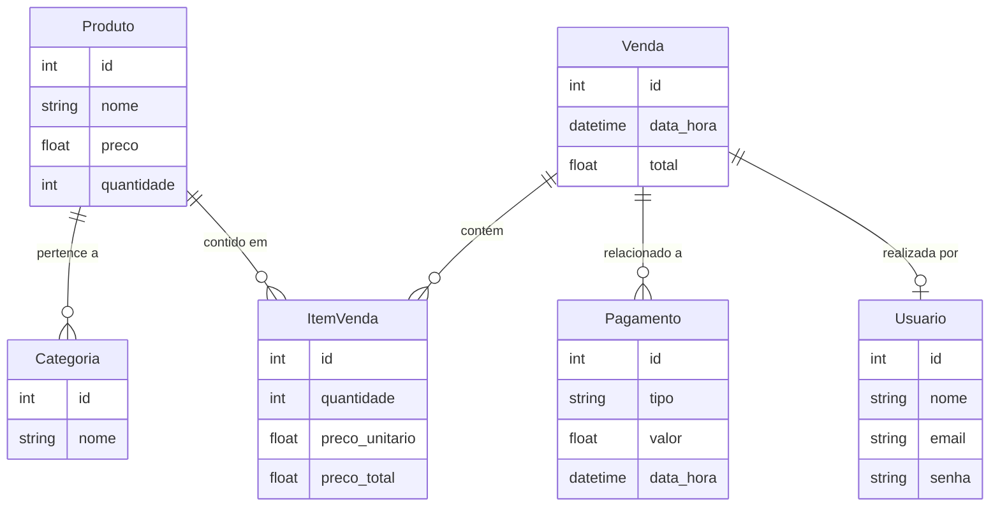
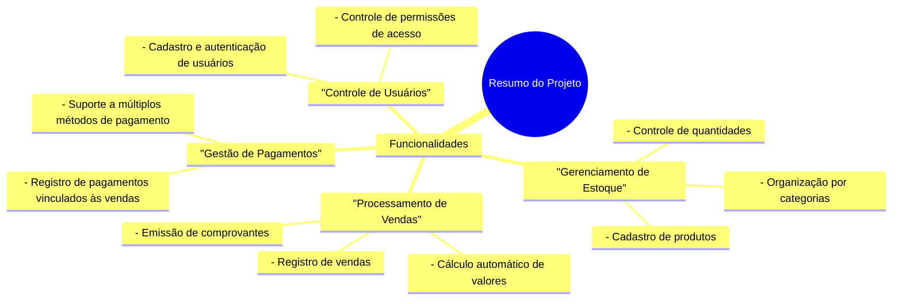

# EstoqueLoja

```mermaid
erDiagram

  Produto {
    int id
    string nome
    float preco
    int quantidade
  }

  Categoria {
    int id
    string nome
  }

  Venda {
    int id
    datetime data_hora
    float total
  }

  ItemVenda {
    int id
    int quantidade
    float preco_unitario
    float preco_total
  }

  Usuario {
    int id
    string nome
    string email
    string senha
  }

  Pagamento {
    int id
    string tipo
    float valor
    datetime data_hora
  }

  Produto ||--o{ Categoria : "pertence a"
  Produto ||--o{ ItemVenda : "contido em"
  Venda ||--o{ ItemVenda : "contém"
  Venda ||--o{ Pagamento : "relacionado a"
  Venda ||--o| Usuario : "realizada por"
```

```mermaid
mindmap
  root((Resumo do Projeto))
    Funcionalidades
      "Gerenciamento de Estoque"
        - Cadastro de produtos
        - Controle de quantidades
        - Organização por categorias
      "Processamento de Vendas"
        - Registro de vendas
        - Cálculo automático de valores
        - Emissão de comprovantes
      "Gestão de Pagamentos"
        - Suporte a múltiplos métodos de pagamento
        - Registro de pagamentos vinculados às vendas
      "Controle de Usuários"
        - Cadastro e autenticação de usuários
        - Controle de permissões de acesso
```

