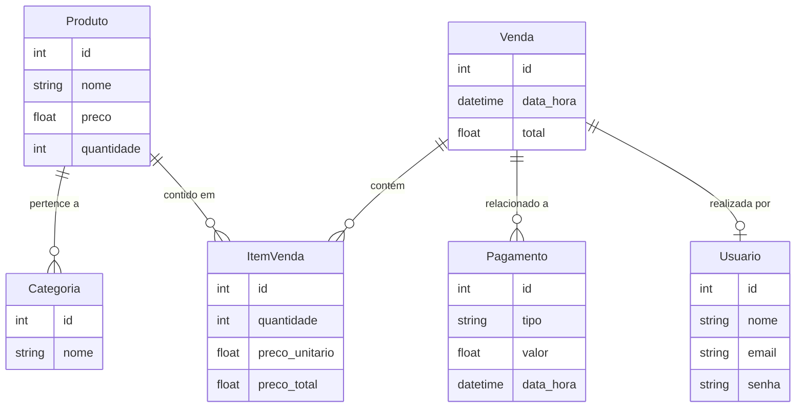
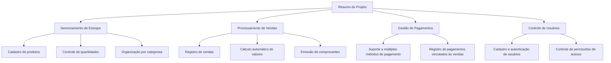

# EstoqueLoja

```mermaid
erDiagram

  Produto {
    int id
    string nome
    float preco
    int quantidade
  }

  Categoria {
    int id
    string nome
  }

  Venda {
    int id
    datetime data_hora
    float total
  }

  ItemVenda {
    int id
    int quantidade
    float preco_unitario
    float preco_total
  }

  Usuario {
    int id
    string nome
    string email
    string senha
  }

  Pagamento {
    int id
    string tipo
    float valor
    datetime data_hora
  }

  Produto ||--o{ Categoria : "pertence a"
  Produto ||--o{ ItemVenda : "contido em"
  Venda ||--o{ ItemVenda : "contém"
  Venda ||--o{ Pagamento : "relacionado a"
  Venda ||--o| Usuario : "realizada por"
```

```mermaid
graph TD;
    A[Resumo do Projeto] --> B[Gerenciamento de Estoque];
    B --> B1[Cadastro de produtos];
    B --> B2[Controle de quantidades];
    B --> B3[Organização por categorias];

    A --> C[Processamento de Vendas];
    C --> C1[Registro de vendas];
    C --> C2[Cálculo automático de valores];
    C --> C3[Emissão de comprovantes];

    A --> D[Gestão de Pagamentos];
    D --> D1[Suporte a múltiplos métodos de pagamento];
    D --> D2[Registro de pagamentos vinculados às vendas];

    A --> E[Controle de Usuários];
    E --> E1[Cadastro e autenticação de usuários];
    E --> E2[Controle de permissões de acesso];

```

